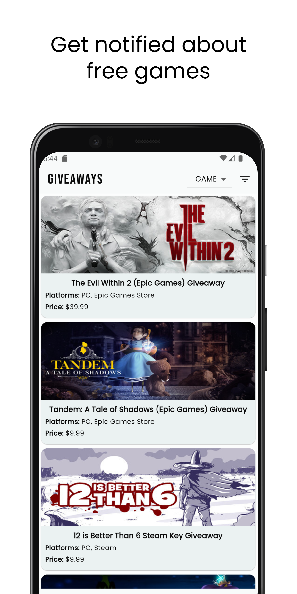
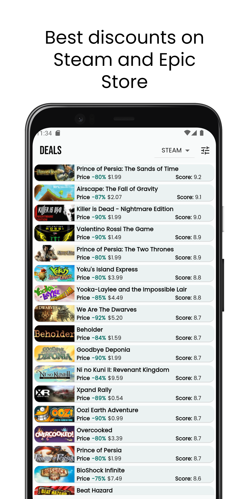
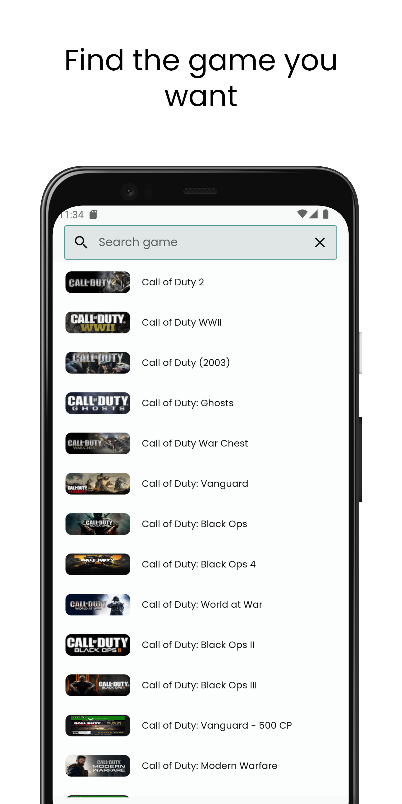
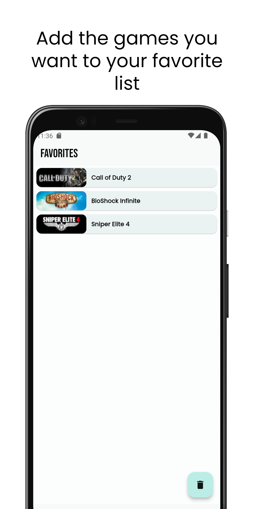
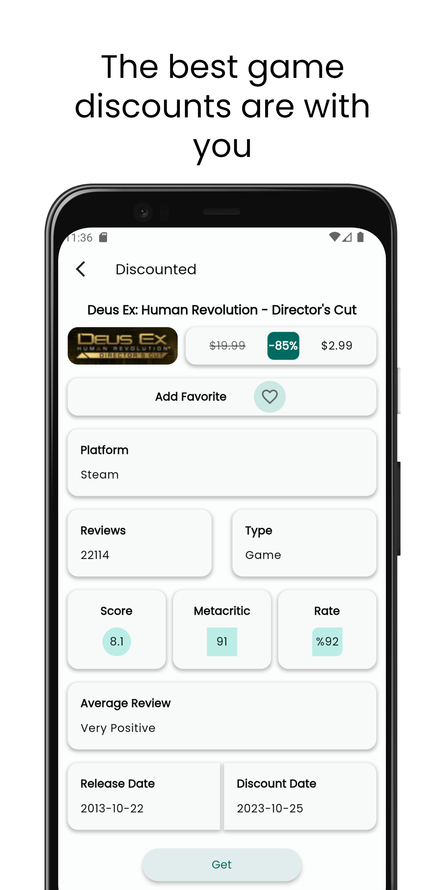
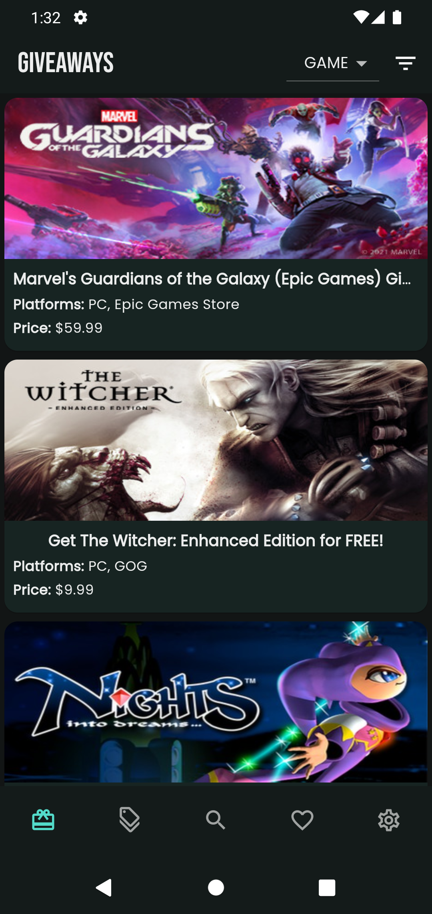
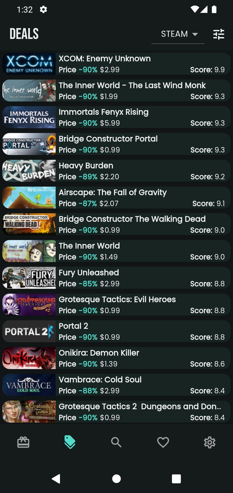
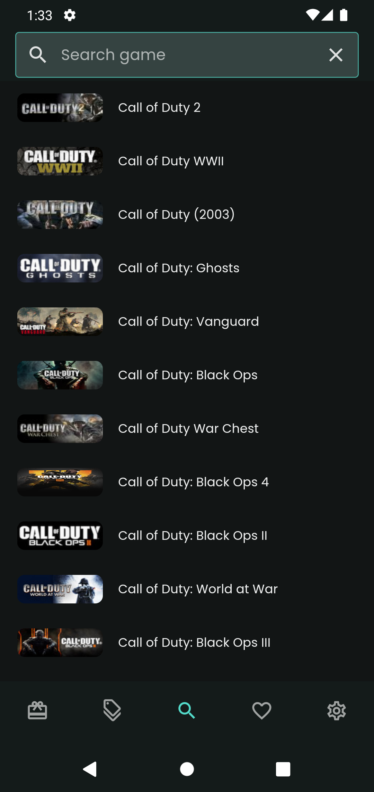
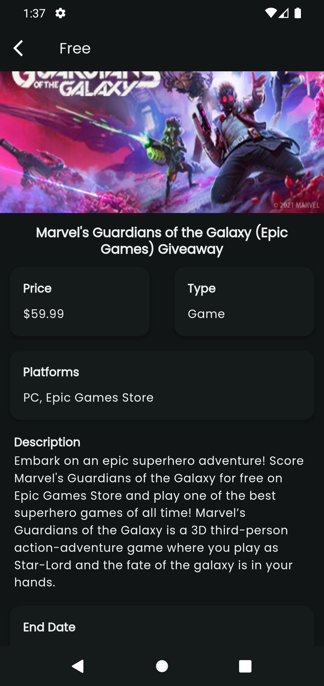
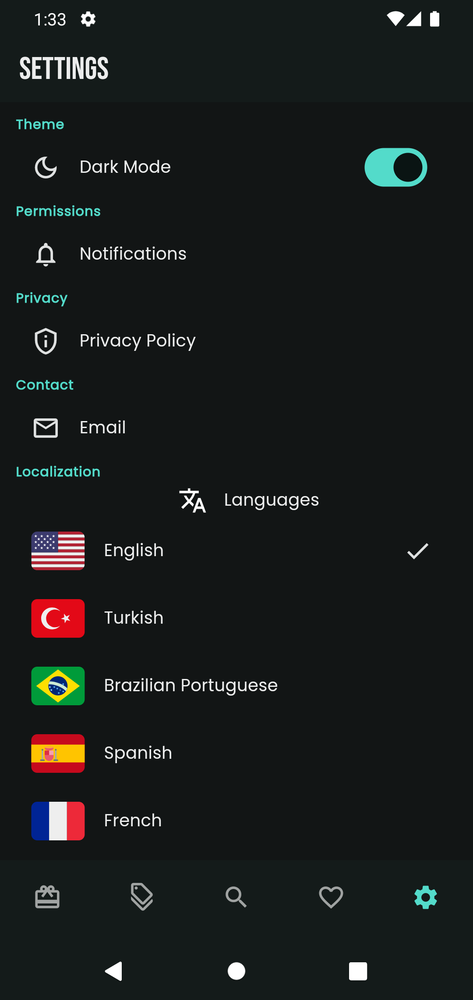

## Get Games
The Flutter app that shows which free games are available in the PC world for short periods of time and which store has the cheapest game. Just click on Firebase Messaging to send notifications to users. Yes, it was made with Material 3 design.

### Public APIs
###### The application was built using two basic APIs
**To List Free Games**
[GamerPower API Documentation](https://www.gamerpower.com/api-read "GamerPower API Documentation")

**To List List Discounted Games**
[CheapShark API Documentation](https://apidocs.cheapshark.com/ "CheapShark API Documentation")

You can find the necessary documentation on the site or send an email to the API owners.

### Screen Shots

  
  
  
  
  

  
  
  
  
  

### Features
- Material Design 3
- Store Filtering
- Price Filtering
- Game Search
- Cheapest store
- All Store Prices
- Favorites Page
- Notifications
- Localization
- Dark Mode

### Tech Stack
- [Riverpod](https://pub.dev/packages/flutter_riverpod "Riverpod")
- [Flex Color Scheme](https://pub.dev/packages/flex_color_scheme "Flex Color Scheme")
- [Shared Preferences](https://pub.dev/packages/shared_preferences "Shared Preferences")
- [Firebase Messaging](https://pub.dev/packages/firebase_messaging "Firebase Messaging")
- [Easy Localization](https://pub.dev/packages/easy_localization "Easy Localization")
- [Flutter Screenutil](https://pub.dev/packages/flutter_screenutil "Flutter Screenutil")
- [Http](https://pub.dev/packages/http "Http")
- [Url Launcher](https://pub.dev/packages/url_launcher "Url Launcher")
- [Cached Network Image](https://pub.dev/packages/cached_network_image "Cached Network Image")

